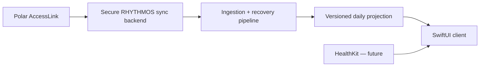

# iOS development plan

## Decision

RHYTHMOS iOS will be a native SwiftUI client, targeting iOS 17 and later. The
first automated data source is Polar AccessLink. The current macOS product
remains supported at `dist/RHYTHMOS.app`; this work neither rebuilds it nor
changes its local data. The iOS client must not embed Streamlit, run a loopback
Python server, or open the macOS `data/recovery.db` directly.

Those shortcuts would produce a fragile mobile UI, make iOS background behavior
unreliable, bypass the current database migration and provenance rules, or
expose Polar OAuth credentials. Polar values are synchronized automatically;
they are not manually entered as a substitute for the provider API.

## Initial project

[`ios/RHYTHMOS`](../ios/RHYTHMOS) contains the first runnable SwiftUI project:

- `Today` presents readiness, data confidence, and next action without turning
  absent measurements into normal values.
- The recovery and sleep cards open read-only detail screens. They retain the
  imported recovery score, confidence, morning/overnight measurements, and
  source/fallback markers, while preserving an explicit unavailable state.
- `DashboardRepository` isolates the presentation layer from storage and future
  data-source decisions.
- The Today toolbar supports a user-selected `MobileDailySnapshot v1` JSON
  import. After validation, it stores an approved snapshot only in the iOS App
  Sandbox so it remains available on later launches. The app does not retain
  folder access or silently copy the desktop database; the user can remove the
  stored snapshot from the same menu.
- The sample repository intentionally displays an insufficient-data state. It
  is safe to run on a simulator and requests no health or account permission.
- The `记录` tab now supports a local manual check-in for subjective recovery,
  training intent, and an optional note. It is deliberately separate from the
  imported projection: user input cannot silently replace a source measurement
  or the desktop-derived recovery score.
- The `趋势` tab charts up to 14 days of those subjective entries locally. It
  does not label them as physiological measurements; objective historical
  trends still require a versioned history projection.
- The project has a small XCTest target for the readiness-state contract.

## Mobile data boundary

The current Python stack remains authoritative for raw Polar/Kubios ingestion,
normalization, daily metrics, baseline, recovery, confidence, and provenance.
The iOS app should consume a versioned, mobile-safe projection—not raw JSON,
Polar tokens, the desktop SQLite file, or cloud AI context.



The selected synchronization design is a secure sync backend: it owns the
Polar client secret and refresh token, reads Polar automatically, runs the
deterministic pipeline, and delivers only the allowlisted v1 projection to
iOS. The client never receives raw Polar payloads or OAuth material. See
[`POLAR_IOS_AUTO_SYNC.md`](POLAR_IOS_AUTO_SYNC.md) for the required boundary.

## Phased delivery

| Phase | Outcome | Gate |
| --- | --- | --- |
| 0 | Native shell, design tokens, sample states | Builds and tests on iOS simulator |
| 1 | Polar automatic sync plus read-only Today, Recovery, Sleep, Training projections | HTTPS callback, encrypted server token storage, snapshot endpoint, and integration tests approved |
| 2 | Local subjective check-in only (never a Polar substitute) | Validation and conflict rules match product policy |
| 3 | HealthKit read integration | Permission UX, data mapping, privacy text, and reconciliation tests approved |
| 4 | Background reliability, disconnect, and sync observability | Registered redirect, refresh behavior, error recovery, and device QA verified |
| 5 | Trends, plans, accessibility, localization, TestFlight | Device QA, privacy review, and no-data/migration tests pass |

## Security and App Store constraints

- Keep tokens in Keychain; never in `UserDefaults`, logs, or exported snapshots.
- HealthKit authorization is requested only when Phase 3 has a clear user-facing
  use; add purpose text and capability at that point.
- Health measurements remain local by default. Any cross-device transfer must
  be explicit, encrypted, and documented.
- Do not claim diagnosis, treatment, or emergency guidance. Preserve the
  existing safety language and transparent evidence model.
- Add Privacy Manifest, export controls, app icon, screenshots, and supported
  language metadata before TestFlight—not as a final release afterthought.

## Immediate next implementation task

`MobileDailySnapshot v1` is now implemented by
[`src/mobile_snapshot.py`](../src/mobile_snapshot.py). It contains only the
Today screen's resolved values, compact provenance, recovery confidence, and
training summary. The CLI reads SQLite in read-only mode:

```bash
.venv/bin/python scripts/export_mobile_snapshot.py \
  --output /secure/user-approved/location/today.json
```

No raw JSON, OAuth material, free-text notes, or desktop row identifiers are
included. This is the lowest-risk shared contract: iOS can now work with real
data states before selecting a cross-device synchronization architecture.
