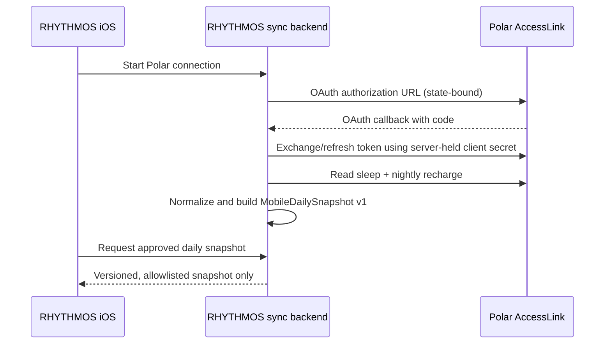

# Polar iOS automatic sync

## Product decision

The first iOS data source is Polar AccessLink. Polar measurements are never
typed into RHYTHMOS as a substitute for synchronization. A user may still keep
a separate subjective check-in, but it is not Polar data and cannot overwrite a
Polar measurement.

## Required security boundary

Polar's authorization-code token exchange and refresh flow require the
registered client secret. The iOS app must therefore not call the token endpoint
or contain the client secret. It must not receive a Polar refresh token either.

The backend stores the Polar refresh token encrypted, associates it with a
RHYTHMOS user/device identity, and returns neither refresh tokens nor raw Polar
payloads to iOS. iOS stores only the already validated mobile snapshot in its
own sandbox.

## First-phase data mapping

| iOS surface | Polar AccessLink source | Mobile field |
| --- | --- | --- |
| Sleep duration / sleep score | Sleep endpoint | `sleep.duration_minutes`, `sleep.score` |
| Nightly HRV / resting heart rate / respiration | Nightly Recharge endpoint | `sleep.nightly_hrv_rmssd_ms`, `sleep.resting_hr_bpm`, `sleep.respiration_rate_bpm` |
| Polar recharge status | Nightly Recharge endpoint | retained as source evidence; it does not replace the RHYTHMOS recovery score |
| RHYTHMOS recovery score | Existing deterministic recovery pipeline after Polar ingestion | `recovery.score`, `recovery.confidence` |

The server must run the existing ingestion, normalization, recovery, and
confidence pipeline before responding. It returns the existing
`rhythmos.mobile_daily_snapshot` v1 contract so the iOS validation and missing
data behavior remain unchanged.

## Sync behaviour

- A foreground sync runs after a successful Polar connection and when the user
  explicitly refreshes.
- Background refresh is best-effort and must respect iOS scheduling; the
  backend remains the source of token refresh and Polar rate-limit handling.
- The client requests only one current-day projection for the Today screen in
  phase 1. Objective history requires a separately versioned history contract.
- A failed sync leaves the last approved snapshot visible and reports its
  timestamp; it never fabricates measurements.

## Implementation prerequisites

1. Deploy a RHYTHMOS sync backend reachable from the iPhone over HTTPS.
2. Register its HTTPS OAuth callback URL in the Polar AccessLink client.
3. Define user/device authentication between the iOS app and this backend.
4. Add server-side encrypted token storage and a revocation/disconnect path.
5. Add integration tests using Polar API fixtures, then connect the iOS sync
   client to the backend's approved snapshot endpoint.
